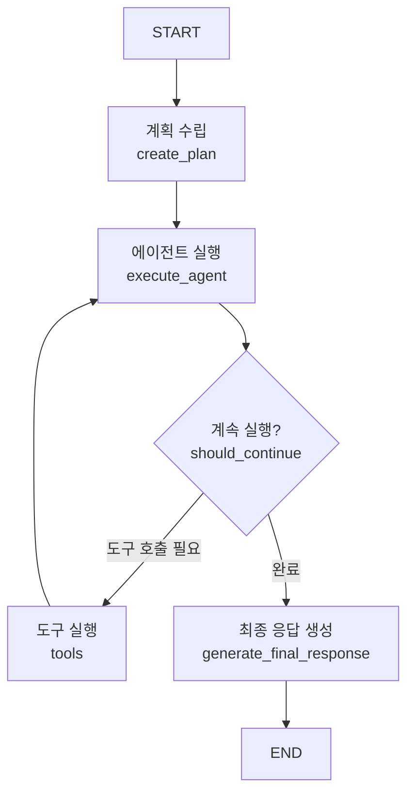

# LangGraph MCP 챗봇 에이전트

이 예제는 LangGraph와 MCP (Model Context Protocol) Tool을 사용하여 챗봇 에이전트를 구현하는 방법을 보여줍니다.

## 개요

두 가지 접근 방식을 제공합니다:

1. **기본 MCP 챗봇** (`basic_mcp_chatbot.py`): 간단한 ReAct 패턴을 사용한 챗봇
2. **Planning MCP 챗봇** (`planning_mcp_chatbot.py`): 계획 수립 단계를 포함한 고급 챗봇

## Planning MCP 챗봇 워크플로우

Planning 챗봇은 다음 5단계로 작동합니다:

```
1. 쿼리 입력
   ↓
2. 쿼리 처리 계획 수립 (Planning)
   ↓
3. 필요한 MCP Tool 호출
   ↓
4. 처리 완료까지 반복 실행 (Agent Loop)
   ↓
5. 최종 결과를 사용자에게 답변
```

### 상세 흐름



## 설치

### 1. 의존성 설치

```bash
pip install -r requirements.txt
```

### 2. 환경 변수 설정

Anthropic API 키를 설정합니다:

```bash
export ANTHROPIC_API_KEY="your-api-key-here"
```

## 사용 방법

### 대화형 데모 실행 (권장)

```bash
python demo.py
```

이 스크립트를 사용하면 대화형 모드로 챗봇과 상호작용할 수 있습니다.

### 기본 MCP 챗봇 실행

```bash
python basic_mcp_chatbot.py
```

### Planning MCP 챗봇 실행

```bash
python planning_mcp_chatbot.py
```

## 예제 출력

Planning 챗봇 실행 예시:

```
======================================================================
LangGraph Planning MCP 챗봇
======================================================================

[단계 1] 쿼리 입력: 123 곱하기 456을 계산하고, 그 결과에 100을 더한 후 2로 나눈 값은?

[단계 2] 계획 수립 중...
계획:
1. 123과 456을 곱한다
2. 결과에 100을 더한다
3. 그 값을 2로 나눈다
4. 최종 결과를 사용자에게 제공한다
필요한 도구: multiply, add, divide

[단계 3-4] 에이전트 실행 중... (반복 1회)

[결정] 도구 호출 필요: 1개

[단계 3-4] 에이전트 실행 중... (반복 2회)

[결정] 도구 호출 필요: 1개

[단계 3-4] 에이전트 실행 중... (반복 3회)

[결정] 도구 호출 필요: 1개

[단계 3-4] 에이전트 실행 중... (반복 4회)

[결정] 최종 응답 생성 단계로 이동

[단계 5] 최종 응답 생성 중...
최종 응답: 계산 결과는 28,244입니다.

======================================================================
실행 완료!
======================================================================

최종 답변:
계산 결과는 28,244입니다.
```

## 구조 설명

### 1. State 정의

```python
class AgentState(TypedDict):
    query: str              # 사용자 쿼리
    plan: str               # 실행 계획
    messages: list          # 대화 메시지
    final_response: str     # 최종 응답
    iteration: int          # 반복 횟수
```

### 2. 주요 노드

- **create_plan**: 쿼리를 분석하고 실행 계획을 수립
- **execute_agent**: LLM을 호출하여 다음 액션 결정
- **tools**: MCP 도구를 실행
- **generate_final_response**: 최종 응답 생성

### 3. 조건부 분기

`should_continue` 함수가 다음을 결정:
- 도구 호출이 필요한가? → `tools`로 이동
- 작업이 완료되었는가? → `generate_final_response`로 이동
- 최대 반복 횟수에 도달했는가? → 강제로 응답 생성

## MCP 서버

### 계산기 서버

`mcp_servers/calculator_server.py`는 다음 도구를 제공합니다:

- `add`: 덧셈
- `subtract`: 뺄셈
- `multiply`: 곱셈
- `divide`: 나눗셈
- `power`: 거듭제곱
- `modulo`: 나머지 연산

### 사용자 정의 MCP 서버 추가

새로운 MCP 서버를 추가하려면:

1. `mcp_servers/` 디렉토리에 서버 파일 생성
2. `setup_mcp_tools()` 함수에 서버 설정 추가:

```python
client = MultiServerMCPClient({
    "calculator": {
        "command": "python",
        "args": ["mcp_servers/calculator_server.py"],
        "transport": "stdio",
    },
    "your_server": {
        "command": "python",
        "args": ["mcp_servers/your_server.py"],
        "transport": "stdio",
    }
})
```

## 주요 기능

### 1. 자동 계획 수립

LLM이 쿼리를 분석하여 자동으로 실행 계획을 생성합니다.

### 2. 반복 실행 (Agent Loop)

작업이 완료될 때까지 자동으로 도구를 호출하고 결과를 처리합니다.

### 3. 무한 루프 방지

최대 반복 횟수 제한으로 무한 루프를 방지합니다.

### 4. 구조화된 출력

각 단계의 진행 상황을 명확하게 출력하여 디버깅이 용이합니다.

## 커스터마이징

### LLM 모델 변경

```python
# Claude 3.5 Sonnet 사용 (기본값)
model = ChatAnthropic(model="claude-3-5-sonnet-20241022")

# 다른 모델로 변경
model = ChatAnthropic(model="claude-3-opus-20240229")
```

### 최대 반복 횟수 조정

`should_continue` 함수에서:

```python
MAX_ITERATIONS = 10  # 원하는 값으로 변경
```

### 계획 수립 프롬프트 수정

`create_plan` 함수의 `planning_prompt`를 수정하여 계획 수립 방식을 변경할 수 있습니다.

## 문제 해결

### MCP 서버 연결 오류

- MCP 서버 파일 경로가 올바른지 확인
- Python 환경에 `mcp` 패키지가 설치되어 있는지 확인

### API 키 오류

- `ANTHROPIC_API_KEY` 환경 변수가 설정되어 있는지 확인
- API 키가 유효한지 확인

### 도구 호출 오류

- MCP 서버가 정상적으로 실행되고 있는지 확인
- 도구 입력 스키마가 올바른지 확인

## 참고 자료

- [LangGraph 문서](https://langchain-ai.github.io/langgraph/)
- [MCP 프로토콜 문서](https://modelcontextprotocol.io/)
- [LangChain MCP Adapters](https://github.com/langchain-ai/langchain-mcp)

## 라이선스

이 예제는 LangGraph 프로젝트의 일부입니다.
